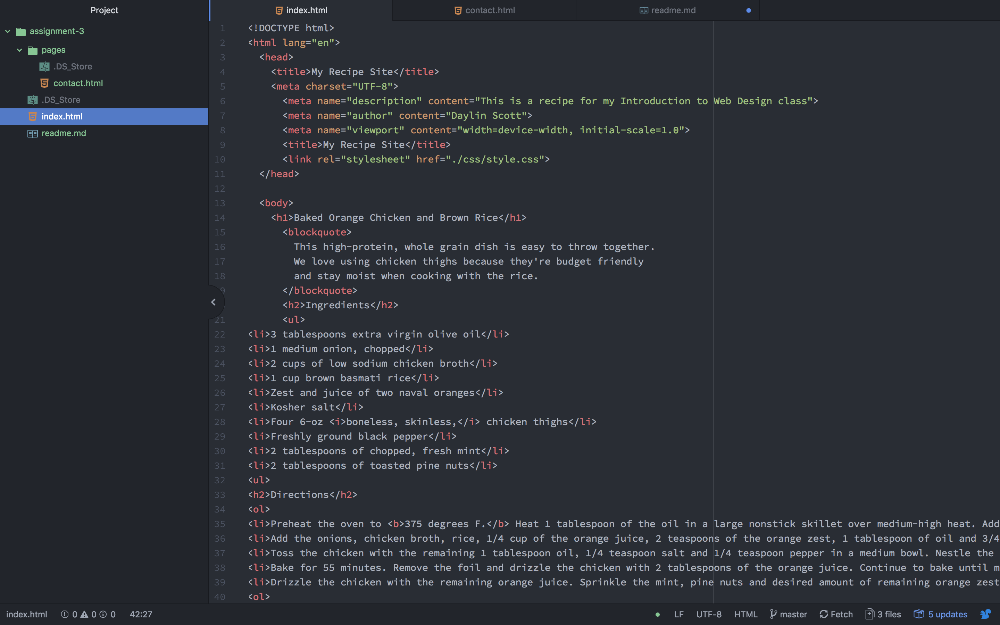

# Technical Report
## How many main head and body elements can a page have? How are these elements different, or what role do they play?
A page should have one main head and one main body element. The head sets up the fundamentals of the page, the style, and the name of the site that shows up in the browser, while the body contains most of the actual content in the site, such as photos or text.

##  Describe the difference between structural and semantic markup.
From what I understand, structual markup is sort of the outline of any given code, like the headers and the paragraghs, while semantic markup is more of a tool to use within structural markup, for things such as fonts, deffinitions, or quotes.

## My Work Cycle
I enjoyed this assignment and had very little trouble overall, i really feel as though I am becoming familiar with the language, and I appreciate the clear and concise instructions that we are provided with, as well as the outside resources. (i apologize that it is late, I have sent an email explaining)

## screenshot

