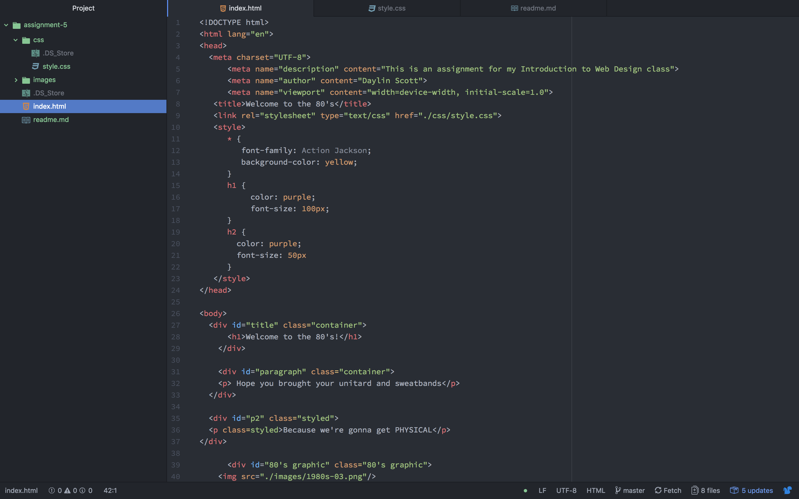

# Technical Report
## Briefly share your design research for this assignment. What graphic or graphics did you choose, from what decade? How did you try to style your "art page" to reflect your exploration of this decade's design trends?
For this assignment, I chose the 80's as my decade, and of the graphics given to choose for this decade, I chose the pink and green and yellow square. I tried to make this page very flamboyant and neon, just like the 80's were.

##  Describe your color palette, including the 3 colors you chose. List their color names, rgb values, or hex codes.
My color palette was fairly bright, consisting of pink, purple, yellow, and green. I did this to reflect the feeling of the 80's and also to keep a feeling of consistency between the color scheme and the graphic that I chose to use.

## My Work Cycle
I enjoyed this assignment and I am enjoying learning more about the actual design aspects of web design, however, I had a great deal of trouble with it. I spent upwards of five hours trying to get everything the way I wanted, but towards the end I began to grow very frustrated. I wanted to change the size of my graphic but everything I tried wasnt working, and I put a line at the bottom of the page to try to incorporate the change in opacity, but I still can't seem to get it to show up. Coding is not something that comes naturally to me, and I'm hoping that I'll get better at it in the future.

## screenshot
 
