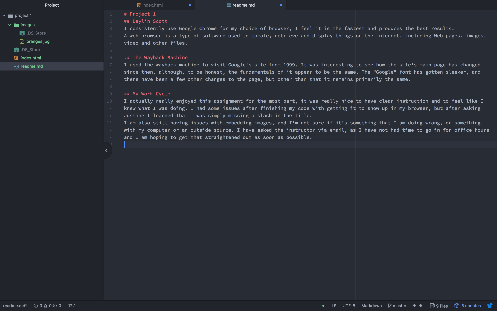

# Project 1
## Daylin Scott
I consistently use Google Chrome for my choice of browser, I feel it is the fastest and produces the best results.
A web browser is a type of software used to locate, retrieve and display things on the internet, including Web pages, images, video and other files.

## The Wayback Machine
I used the wayback machine to visit Google's site from 1999. It was interesting to see how the site's main page has changed since then, although, to be honest, the fundamentals of it appear to be the same. The "Google" font has gotten sleeker, and there have been a few other changes to the page, but other than that it remains primarily the same.

## My Work Cycle
I actually really enjoyed this assignment for the most part, it was really nice to have clear instruction and to feel like I knew what I was doing. I had some issues after finishing my code with getting it to show up in my browser, but after asking Justine I learned that I was simply missing a slash in the title.
I am also still having issues with embedding images, and I'm not sure if it's something that I am doing wrong, or something with my computer or an outside source. I have asked the instructor via email, as I have not had time to go in for office hours and I am hoping to get that straightened out as soon as possible.

 
